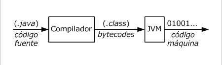

# 1. Fundamentos de java

## 1.1 Características de Java
Las principales características de Java son:

- **Orientado a objetos.** El codigo es escrito en clases, las cuales contienen atributos (caracteristicas de la clase) y metodos que pueden ser inovcados por instancias de la clase.
Los lenguajes orientados a objetos tienen una serie de caracteristicas como herencia, sobrecarga, sobreescritura, polimorfismo y encapsilacion, que los dotan de un gran potencia.

- **Portabilidad.** Java nos brinda la posibilidad de poder compilar una vez y ejecutar en cualquier parte, esto es gracias a un elemento clave del lenguaje llamado Java Virtual Machine (JVM). Esto quiere decir que el resultado de la compilacion es independiente a la plataforma y puede ejecutarse en cualquier sistema que cuenta con una JVM.
Esta es quizas la caracteristica principal del lenguaje. 

* **Encapsulación.** Consiste en la protección de atributos de la clase para que no sean accesibles desde el exterior, permitiendo el acceso a ellos mediante metodos.

* **Robusto.** La JVM gestiona de manera automática la memoria, de tal forma que no se permite el acceso a ella desde código y evita problemas de violación de acceso.

* **Seguro.** El código Java es ejecutado en un entorno controlado por la JVM lo que impide que se realicen operaciones dañinas sobre el equipo

## 1.2 Ciclo de vida de un programa Java
El ciclo de vida de un programa java se puede dividir en las siguientes fases:

- **Creacion de programa:** consiste en crear el codigo fuente del programa, generando los archivos .java necesarios.

- **Compilacion:** el codigo fuente del programa es compilado conviertindolo a bytecodes (archivo .class)
  
- **Ejecucion:** La JVM toma los bytecodes, los carga en memoria y los traduce en código máquina para ejecutar el programa. 



## 1.3 Java Virtual Machine (JVM)
La JVM es un software que se encarga de manejar la ultima fase en el ciclo de vida de una aplicacion java.

La JVM incluye provee diferentes servicios en tiempo de ejecucion como gestor de memoria, sincronizacion de hilos, y manejo de excepciones.
En su interior cuenta con difernetes componentes, entre los cuales se encuentran:
- Garbage Collector
- Class Loader
- JIT Compiler

Existen versionde de la JVM para cada sistema operativo lo que permite que un programa compilado pueda ser ejecutado en cualquier S.O.

Se puede consultar los siguientes enlaces para obtener mas infromacion sobre los componentes de la JVM
<!-- TODO: agregar referencias o enlaces  -->

## 1.4 Creacion de programas en Java
Java es un lenguaje orientado a objetos, por lo que sus aplicaciones se escriben dentro de clases. 

### 1.4.1 Clases
El objetivo de una clase es definir el comportamiento de los objetos creados a partir de ella. Este comportamiento se define mediante atributos y metodos.
- **Atributos:** definen caracteristicas de los objetos
- **Metodos:** definen las operaciones que puede realizar un objeto

Podemos ver una clase como un molde (prototipo) y a los objetos como entidades "fisicas" creadas mediante el molde

Pare definir una clase utilizamos la palabra `class`, seguida del nombre de la clase y entre comillas definimos el contenido de la clase.

```java
class Car{
  String model; //atributo
  public Car(){ //constructor
    
  }

  public void start(){ //método
    
  }
}
```

Un archivo .java puede contener 1 o más clases, pero solo una debe tener la palabra reserveda public (y debe coinicidir con el nombre del archivo .java)

Suponiendo que tenemos un archivo con el nombre Car.java, un ejemplo del contenido del archivo puede ser el siguiente
```java
public class Car{
  public void start(){
    
  }
}

class Driver{
  public void driving(){

  }
}
```

> [!CAUTION]
> Podemos ocasionar errores de compilacion si:
> - Dos o más clases dentro de un archivo .java contienen la palabra `public`
> - El nombre de la clase que contiene la palabra `public` no coincide con el nombre del archivo


### 1.4.2 Paquetes (Packages)
Las clases se organizan en paquetes (directorios), un paquete puede contener varios archivos .java e incluso subpaquetes

Dentro del archivo .java el paquete se indica utilizando la palabra **package** y debe colocarse al inicio, de modo que todas las clases contenidas en este archivo sé encontrar en el mismo paquete.
Ejemplo
```java
package mypackage;

public class Clase1{
  public void metodo1(){
    
  }
}

class Clase2{
  public void metodo2(){

  }
}
```

> [!IMPORTANT]
> la sentencia `package` debe ser la primera en el archivo .java

### 1.2.4 Importacion de clases

Cuando se necesita utilizar una clase que se encuentra en un paquete diferente se debe importar, para ello utilizamos la sentencia import.

```java
import java.util.ArrayList; //importa una clase
import java.util.*; //importa todas las clases de un paquete
import static java.lang.Math.*; //importa elementos estaticos de una clase
```

La sentencia import debe colocarse despues de la sentencia package y antes de la definicion de la clase

```java
package mypackage;

import java.util.ArrayList; 

public class myClass{

}
```

>[!CAUTION]
>Es importante respetar el orden de las sentencias package e import, ya que de no ser asi se puede generar un error de compilacion

### 1.2.5 Metodo main
El metodo `main()` representa el punto de entrada/inicio de un programa Java. Este metodo es utilizado por la JVM para ejecutar una clase.
Es comun que los programas en Java cuenten con muchas clases, entre todas ellas una debera contener el metodo main.

El metodo main puede tener dos formatos validos.
La diferencia entre ellos es la forma de definir los argumentos de entrada, estos pueden ser con un arreglo de String (formato 1) o indicando un numero de variable de argumentos (formato 2)

```java
//formato 1
public class ClaseA{
  public static void main (String[] args){

  }
}

//formato 2
public class ClaseA{
  public static void main (String ... args){

  }
}
```

Algunos ejemplos incorretos de la declaracion del metodo main son los siguientes
```java

static void main(String[] args) //falta public

public void main(String[] args) //falta static

public static int main(String[] args) //tipo de retorno incorrecto

public static void Main(String[] args) //nombre incorrecto

```


> [!CAUTION]
> Los ejemplos anteriores no provocan un error de compilacion ya que sintacticamente son correctos, sin embargo se generaria un error ejecucion ya que la JVM no encontraria el metodo main

## 1.3 Compilacion y Ejecucion

### 1.3.1 Herramientas JDK

El JDK (Java Development Kit) cuenta con un conjunto de herramientas basicas que nos permiten compilar y ejecutar progrmas java, asi como con las clases que forman el Java Standard Edition (Java SE)

El comando para compilar un archivo .java tiene el nombre de `javac`, mientras que el comando para ejecutar una clase se llama `java`. Ambos comandos se enccuentran dentro del directorio de instalacion del JDK, en la subcarpeta bin.

### 1.3.2 Compilacion 

Para compilar un archivo .java, debemos situarnos desde terminal en la ruta donde se encuentre nuestro archivo y lanzaremos el comando

```shell
javac Archivo.java
```

Si las clases se encuentran definidad en un paquete y queremos generar la estructura de carpetas correspondiente debemos usar el comando

```shell
javac -d . Archivo.java
```

En caso de existir errores de compilacion se mostraran en la salida del comaando, de lo contrario se generaran los arhivos .class correspondientes.

### 1.3.3 Ejecucion

Para ejecutar un programa java deberemos colocarnos desde terminal en la ruta donde se realizo la compilacion y ejecutaremos el siguiente comando utilizando la clase que contiene el metodo main.

```shell
java Archivo
```

si la clase se ecuentra dentro de algun paquete, se debe indicar el nombre cualificado de la clase.

```shell
java paquete.Archivo
```

> [!NOTE]
> Al ejecutar una clase se indica el nombre de la misma, no el nombre del archivo .class

### 1.3.4 Argumentos por linea de comandos

Al ejecutar la clase principal es posible pasar argumentos al metodo main, estos se almacenan en el arreglo de String.

```shell
java NombreClase arg1 arg2
```

Si algun argumento debe contener espacios se deben utilizar comillas.

```shell
java NombreClase "primer argumento" arg2
```


> [!CAUTION]
> Se debe tener cuidado con los indices del array, ya que si se intenta acceder a un indice que no existe se provocara una excepcion del tipo ArrayIndexOutOfBoundsException

### 1.1.1 Compilación de un programa Java
Los programas en Java se escriben en archivos .java (código fuente), al compilar estos archivos se generan archivos .class conocidos como bytecodes, estos son independientes de la plataforma y se pueden ejecutar en cualquier sistema que cuente con una JVM.