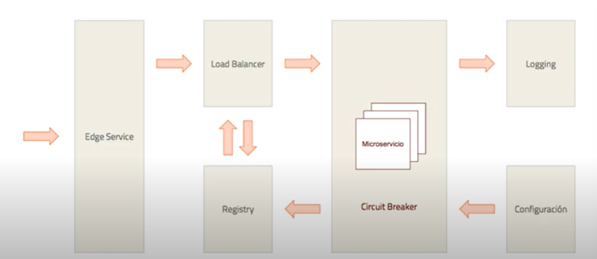
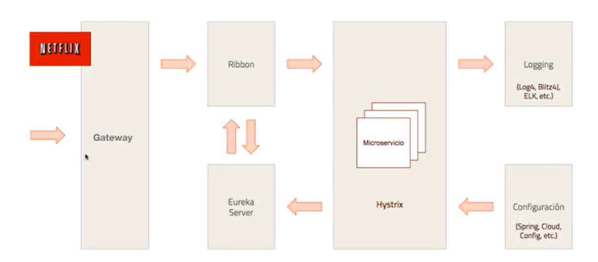

# Microservicios
Los microservicios son un arquitectura para desarrolla software el cual consiste en construir un aplicacion como un conjunto de pequeños servicios independientes entre si, cada uno se ejecuta en procesos diferentes y se comunican por mecanismos ligeros (comunmente API REST).

## Ventajas
- Escalabilidad: escalado horizontal eficiente, en funcion de la demanda, brindando alta disponibilidad
- Modularidad: cada microservicio realiza una funcion acotada, cada uno hara una cosa y lo hara bien, produciendo eficiencia y simplicidad
- Heterogeneos: cada microservicio puede ser desarrollado en tecnologias diferentes segun las necesidades
- Desacoplamiento: los microservicios son independientes, cada uno realiza sus responsabilidades, maneja sus datos, promoviendo el maximo desacople posible.
- Despliegue rapido: integracion y despliegue continuo usando contenedores.

## Componentes
- Registry: registra y descubre los microservicios
- Config: permite registrar una configuracion centralizada para los microservicios
- Load Balancer: permite distribuir la carga de trabajo entre los microservicios
- Circuit Breaker: permite manejar la tolerancia a fallos de los microservicios
- Api GateWay: es el unico punto de acceso a los microservicios
- Log Center: punto centralizado donde se guardaran logs de los microservicios

Un modelo de alto nivel de una arquitectura de microservicios es el siguiente:

Spring ofrece las siguientes herramientas para implementar esta arquitectura.

## API Rest
Es una interfaz basada en el protocolo HTTP, permite la comunicacion entre varios sistemas y es util para obtener y generar datos y operaciones.
Comunmente devuelven informacion en formatos especificos (JSON Y XML)

### Ventajas
- Separacion de Backend y Frontend
- Heterogeniedad
- Despemeño: son ligeros, mas rapidos y utilizan menos ancho de banda

## Idempotencia 
La idempotencia nos dice que, la ejecucion repetida de una peticion con los mismos parametros sobre un mismo recurso tendra el mismo efecto en el estado de nuestro recurso si se ejecuta 1 o N veces.
Mas infromacion del tema:
- [REST y el principio de idempotencia](https://adictosaltrabajo.com/2015/06/29/rest-y-el-principio-de-idempotencia/)
- [Idempotencia en APIs REST](https://www.mentorestech.com/resource-blog-content/idempotencia-en-apis-rest-que-es-y-por-que-es-importante)

